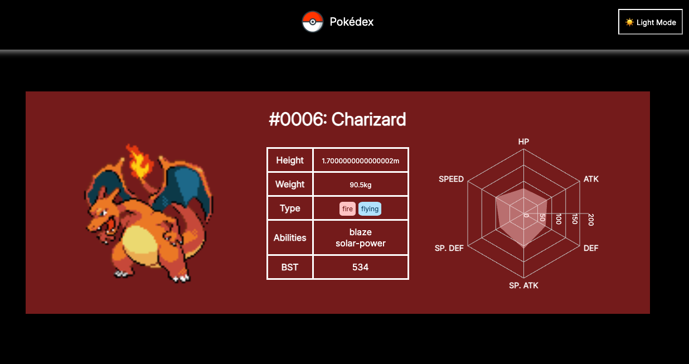

# Pokédex Web App

A full-stack Pokédex application that lets users explore Pokémon data with beautiful visuals and responsive design.

---

## 🧠 Technologies Used

- **API**: PokeAPI
- **Frontend**: React
- **Web Scraping**: Python + BeautifulSoup
- **Charting**: Recharts.js (for Pokémon stat radar charts)
- **Routing**: React Router

---

## 🌟 Features
- 🔍 Search Pokémon by name
- 🧭 Navigate to detail pages
- 💡 Toggle between light and dark mode

---

## 🔮 Future Work
- **🧭 Feature Enhancements**
  - Filter Pokémon by type, stat range, or generation
  - Visualize evolution chains with interactive components
  - Display learnable moves and TM/HM compatibility. 
  - Include Pokédex entries

--- 
## 📚 Data Sources

- Pokémon stats, types, abilities, and sprites are sourced from:

  - [Pokémon Database](https://pokemondb.net) — for sprites and structured stat/type data
  - [Serebii.net](https://www.serebii.net) — for national Pokédex table and additional information